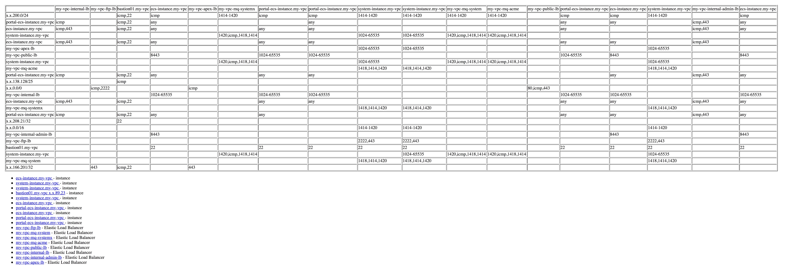

aws-visualizer
==============
Visualizing the potential network dependencies within a VPC based on the security groups.

It can generate the following:
- An HTML table with all security group dependencies between network components.
- A graph of all security group dependencies between network components.
- A graph of all security group dependencies between network components grouped by security groups.
- A graph of all security group dependencies between network components grouped by subnet.


html table
----------
An HTML table with all security group dependencies between network components.
.

overall graph
--------------
A graph of all security group dependencies between network components.
 

Grouped by security group
--------------------------
A graph of all security group dependencies between network components grouped by security groups.
 

Grouped by subnets
------------------
A graph of all security group dependencies between network components grouped by subnet.
 


usage
=====
graph\_region.py [--directory output-directory ] 
	[ --use-subnets | --use-security-group-subgraphs ] 
	[--profile aws-profile] 
	[--region aws-region] 
	[--exclude-security-group security-group]
	[--no-dot-output]

--profile aws-profile
	to use to connect 

--region aws-region
	to graph vpc's of

--use-subnets
	uses subgraphs for use subnet in the vpc.
	default is false.

----use-security-group-subgraphs
	uses security group grouping as subgraphs.
	default is false.

--exclude-security-group
	comma separated list of security groups to exclude from graph. 

--no-dot-output
	do not generate dot output files. Will only generate a HTML table


INSTALL
-------
- install python
- install graphviz
- pip install boto3 netaddr


```
python graph_region.py --profile name_goes_here --directory /tmp/ --use-subnets --region us-west-1
profile python graph_region.py --profile anothor_profile --directory /tmp/ --use-subnets --region us-west-1
```

Quickstart
-----------
./run.sh will generate three different views for each subnet in target: default, securitygroups and subnet.

